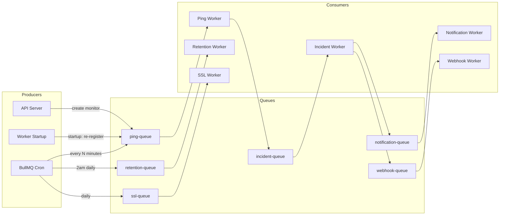
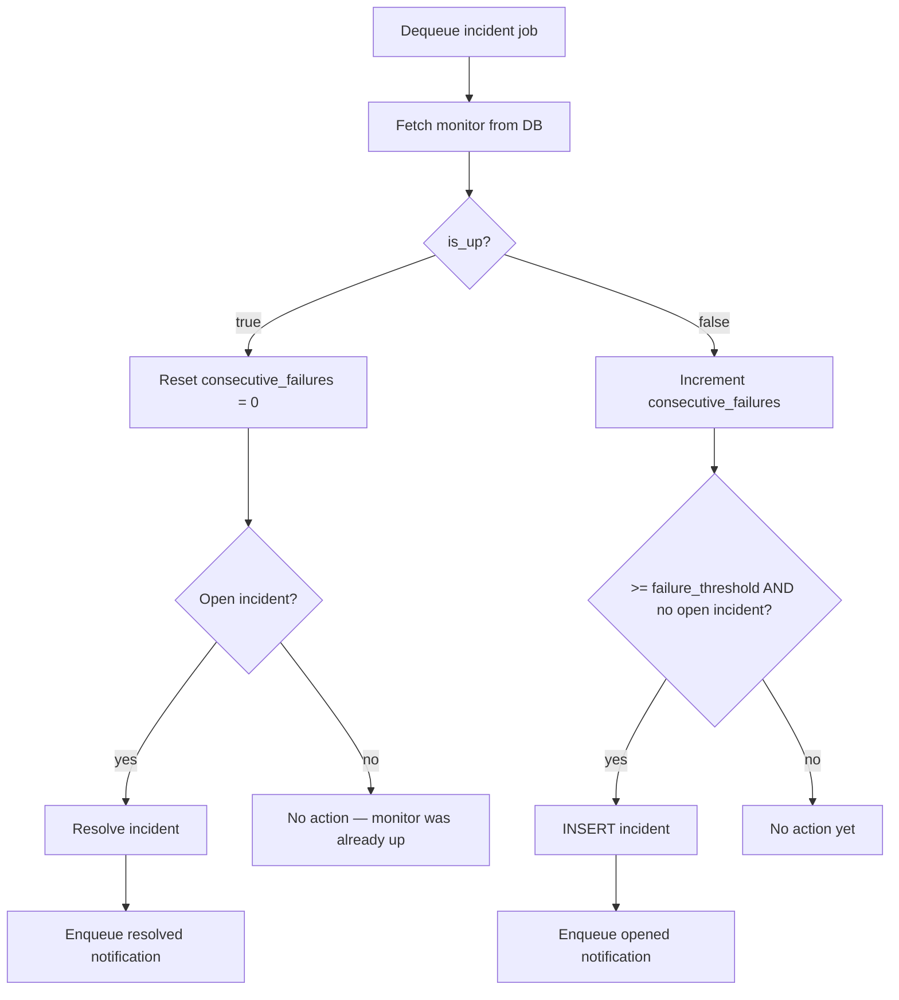
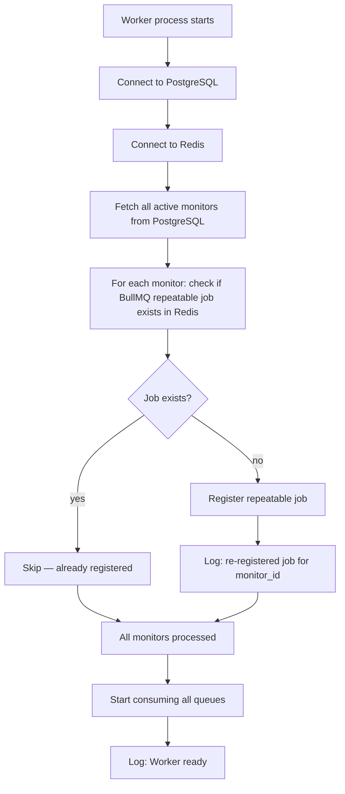
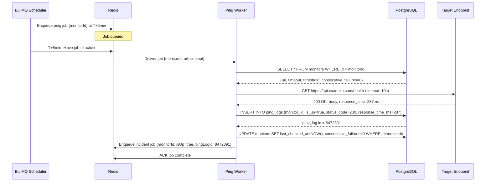
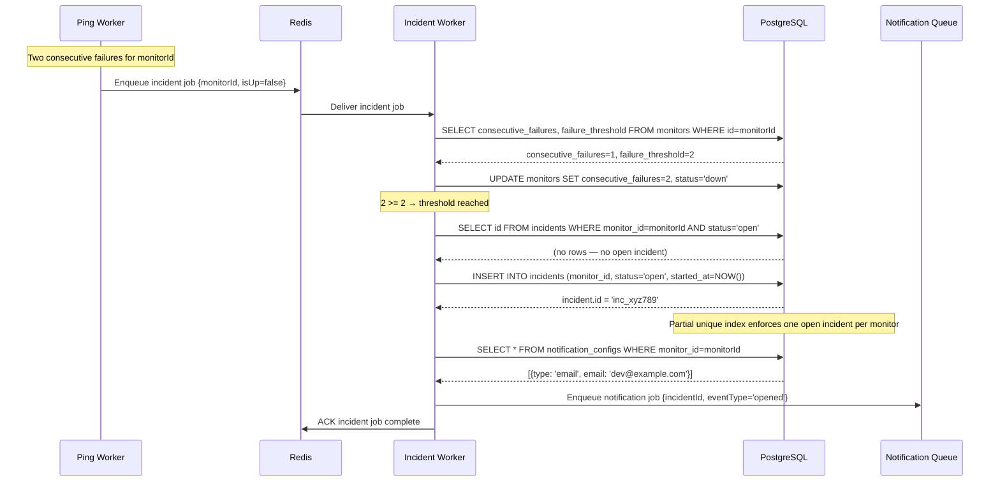
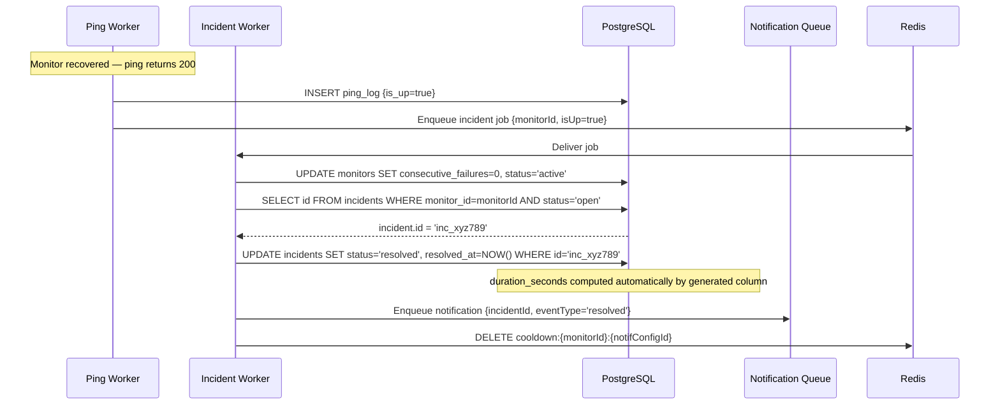
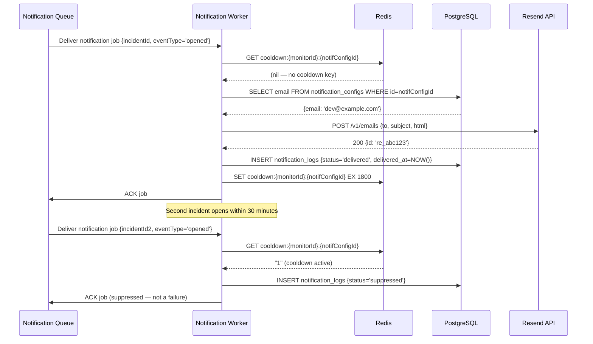
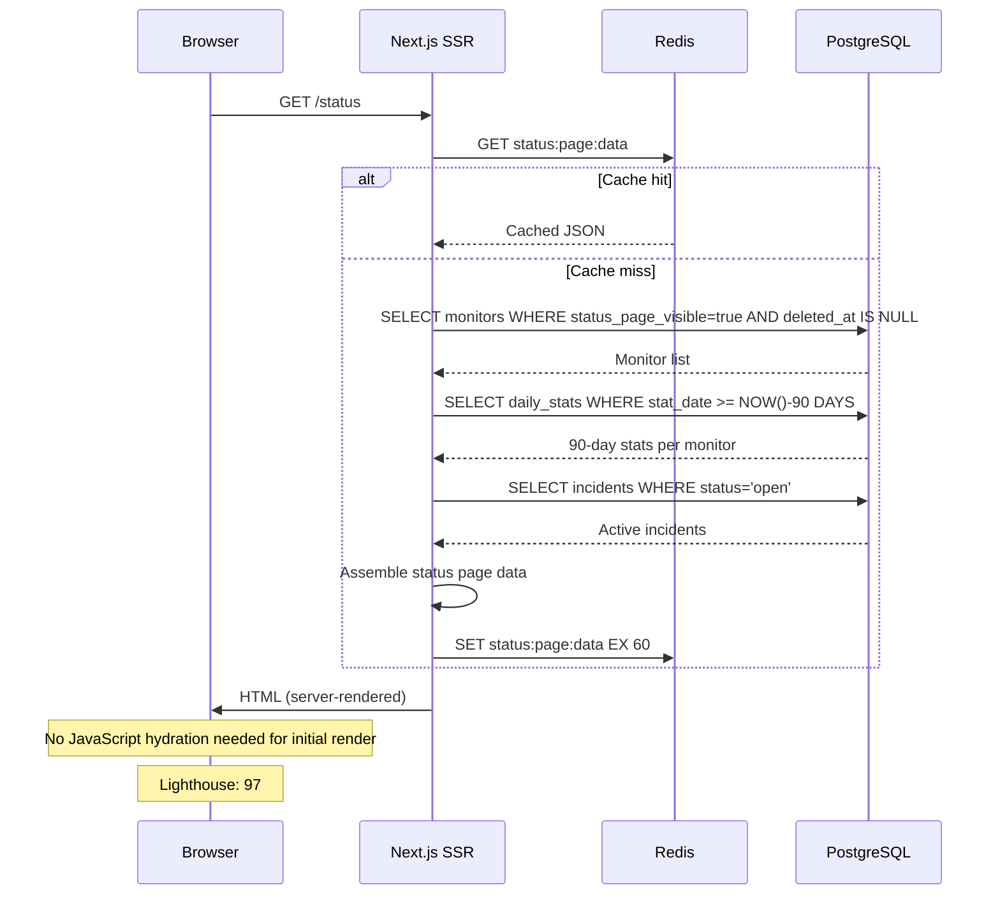
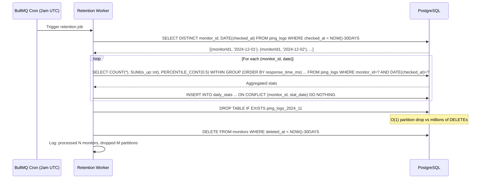

---

## 11. REST API Contract

> All authenticated endpoints require a valid Auth.js session cookie. All responses are `application/json`. All timestamps are ISO 8601 UTC strings.

---

### Base URL

```
https://your-app.railway.app/api
```

---

### Authentication

Auth is handled via Auth.js v5 session cookies. All `/api/*` routes (except `/api/health` and the Next.js-rendered `/status` page) require authentication.

A valid session is established after GitHub OAuth. The session cookie is `httpOnly`, `sameSite: 'lax'`, `secure: true` in production.

---

### Common Error Responses

| Status | Code | Meaning |
|---|---|---|
| 400 | `VALIDATION_ERROR` | Request body failed Zod validation |
| 401 | `UNAUTHORIZED` | No valid session |
| 403 | `FORBIDDEN` | Session valid but resource belongs to another user |
| 404 | `NOT_FOUND` | Resource does not exist or is soft-deleted |
| 409 | `CONFLICT` | e.g., open incident exists; force delete required |
| 422 | `UNPROCESSABLE` | Business rule violation (e.g., SSRF URL) |
| 429 | `RATE_LIMITED` | Exceeded 100 req/min |
| 500 | `INTERNAL_ERROR` | Unexpected server error |

---

### Monitors

#### `GET /api/monitors`

Retrieve all monitors for the authenticated user.

**Query parameters:**

| Param | Type | Description |
|---|---|---|
| `status` | string (optional) | Filter by status: `active`, `down`, `paused` |
| `page` | integer (default: 1) | Pagination page |
| `limit` | integer (default: 20, max: 100) | Page size |
| `sort` | string (default: `created_at`) | Sort field: `created_at`, `name`, `status` |
| `order` | string (default: `desc`) | `asc` or `desc` |

**Response `200`:**
```json
{
  "data": [
    {
      "id": "mon_abc123",
      "name": "Production API",
      "url": "https://api.example.com/health",
      "status": "active",
      "check_interval_minutes": 5,
      "failure_threshold": 2,
      "timeout_seconds": 10,
      "consecutive_failures": 0,
      "last_checked_at": "2025-01-15T10:30:00Z",
      "uptime_percent_30d": 99.87,
      "status_page_visible": true,
      "created_at": "2025-01-01T00:00:00Z"
    }
  ],
  "pagination": {
    "page": 1,
    "limit": 20,
    "total": 3,
    "total_pages": 1
  }
}
```

---

#### `POST /api/monitors`

Create a new monitor.

**Request body:**
```json
{
  "name": "Production API",
  "url": "https://api.example.com/health",
  "check_interval_minutes": 5,
  "failure_threshold": 2,
  "timeout_seconds": 10,
  "keyword_check": "\"status\":\"ok\"",
  "status_page_visible": true
}
```

**Zod schema:**
```typescript
const CreateMonitorSchema = z.object({
  name: z.string().min(1).max(100),
  url: z.string().url().startsWith('http'),
  check_interval_minutes: z.enum(['1','5','15','30','60']).transform(Number),
  failure_threshold: z.number().int().min(1).max(5).default(2),
  timeout_seconds: z.number().int().min(5).max(30).default(10),
  keyword_check: z.string().max(200).optional(),
  status_page_visible: z.boolean().default(true)
});
```

**Response `201`:**
```json
{
  "data": {
    "id": "mon_abc123",
    "name": "Production API",
    "url": "https://api.example.com/health",
    "status": "pending",
    "check_interval_minutes": 5,
    "failure_threshold": 2,
    "timeout_seconds": 10,
    "created_at": "2025-01-15T10:00:00Z"
  }
}
```

**Errors:**
- `422` if URL resolves to private IP (SSRF prevention)
- `400` if `check_interval_minutes` not in allowed set

---

#### `GET /api/monitors/:id`

Retrieve a single monitor with recent ping logs and open incident.

**Response `200`:**
```json
{
  "data": {
    "id": "mon_abc123",
    "name": "Production API",
    "url": "https://api.example.com/health",
    "status": "active",
    "uptime_percent_30d": 99.87,
    "p95_response_time_ms": 342,
    "recent_ping_logs": [
      {
        "checked_at": "2025-01-15T10:30:00Z",
        "is_up": true,
        "status_code": 200,
        "response_time_ms": 287
      }
    ],
    "open_incident": null,
    "ssl": {
      "expires_at": "2025-06-01T00:00:00Z",
      "days_remaining": 137,
      "is_valid": true
    }
  }
}
```

---

#### `PATCH /api/monitors/:id`

Partial update a monitor.

**Request body (all fields optional):**
```json
{
  "name": "Updated Name",
  "check_interval_minutes": 1,
  "status": "paused"
}
```

**Business logic:**
- If `status` set to `paused`: removes BullMQ job
- If `status` set to `active`: re-registers BullMQ job
- If `check_interval_minutes` changes: removes old BullMQ job, registers new one
- If `url` changes: resets `consecutive_failures = 0`

**Response `200`:** Updated monitor object.

---

#### `DELETE /api/monitors/:id`

Soft-delete a monitor.

**Query params:**
- `?force=true` — required if monitor has an open incident

**Response `204`:** No content.

---

### Ping Logs

#### `GET /api/monitors/:id/ping-logs`

Retrieve paginated ping logs for a monitor.

**Query params:**

| Param | Type | Default |
|---|---|---|
| `from` | ISO 8601 date | 24 hours ago |
| `to` | ISO 8601 date | now |
| `limit` | integer | 100 |
| `is_up` | boolean | (all) |

**Response `200`:**
```json
{
  "data": [
    {
      "id": 8472391,
      "checked_at": "2025-01-15T10:30:00Z",
      "is_up": true,
      "status_code": 200,
      "response_time_ms": 287,
      "error_type": null
    }
  ],
  "pagination": { "total": 288, "page": 1, "limit": 100 }
}
```

---

#### `GET /api/monitors/:id/response-times`

Retrieve daily P50/P95/P99 response time data for charts.

**Query params:**
- `days` — integer (default: 30, max: 90)

**Response `200`:**
```json
{
  "data": [
    {
      "date": "2025-01-14",
      "p50_ms": 210,
      "p95_ms": 387,
      "p99_ms": 542,
      "uptime_percent": 100
    }
  ]
}
```

---

### Incidents

#### `GET /api/monitors/:id/incidents`

Retrieve incident history for a monitor.

**Query params:**

| Param | Type | Default |
|---|---|---|
| `status` | `open` or `resolved` | all |
| `from` | ISO 8601 | 30 days ago |
| `to` | ISO 8601 | now |
| `page` | integer | 1 |

**Response `200`:**
```json
{
  "data": [
    {
      "id": "inc_xyz789",
      "status": "resolved",
      "started_at": "2025-01-10T03:22:00Z",
      "resolved_at": "2025-01-10T03:45:00Z",
      "duration_seconds": 1380,
      "error_type": "HTTP_ERROR",
      "root_cause": null
    }
  ]
}
```

---

#### `PATCH /api/incidents/:id`

Add root cause note to incident (manual annotation).

**Request body:**
```json
{
  "root_cause": "Deployed bad migration — rolled back at 03:44 UTC"
}
```

---

### Notification Configs

#### `GET /api/monitors/:id/notifications`

List notification configs for a monitor.

#### `POST /api/monitors/:id/notifications`

Add notification config.

**Request body (email):**
```json
{
  "type": "email",
  "email": "oncall@example.com",
  "on_incident_open": true,
  "on_incident_resolve": true
}
```

**Request body (webhook):**
```json
{
  "type": "webhook",
  "url": "https://hooks.example.com/alerting",
  "on_incident_open": true,
  "on_incident_resolve": false
}
```

**Response `201`:**
```json
{
  "data": {
    "id": "nc_def456",
    "type": "webhook",
    "url": "https://hooks.example.com/alerting",
    "webhook_secret": "whs_abc123xyz"
  },
  "meta": {
    "note": "Store this secret now — it will not be shown again. Use it to verify the X-StatusPing-Signature header."
  }
}
```

> The raw webhook secret is returned exactly once on creation. The server stores only `SHA-256(secret)`. If lost, the config must be deleted and recreated.

---

### Status Page (Public)

#### `GET /api/status`

Public endpoint returning status page data (used for dynamic status page rendering and potential embeds).

**Authentication:** None required.

**Response `200`:**
```json
{
  "data": {
    "overall_status": "operational",
    "monitors": [
      {
        "name": "Production API",
        "status": "operational",
        "uptime_90d": [
          { "date": "2024-10-17", "uptime_percent": 100 },
          { "date": "2024-10-18", "uptime_percent": 98.61 }
        ]
      }
    ],
    "active_incidents": []
  },
  "meta": {
    "cached_at": "2025-01-15T10:29:45Z",
    "cache_ttl_seconds": 60
  }
}
```

---

### System

#### `GET /api/health`

Health check endpoint for Railway deploy checks.

**Authentication:** None required.

**Response `200`:**
```json
{
  "status": "ok",
  "postgres": "connected",
  "redis": "connected",
  "version": "1.0.0",
  "timestamp": "2025-01-15T10:30:00Z"
}
```

---

### Reports

#### `GET /api/monitors/:id/report/sla?year=2025&month=1`

Generate and stream an SLA PDF report.

**Response:** `application/pdf` stream with header `Content-Disposition: attachment; filename="statusping-sla-2025-01-Production-API.pdf"`

---

## 12. Queue Architecture

### Overview

StatusPing uses five distinct BullMQ queues, each with a dedicated responsibility. Separating queues provides:
- **Independent concurrency settings** — notification delivery doesn't block ping execution
- **Independent retry policies** — a failing webhook shouldn't starve new pings
- **Independent dead-letter isolation** — failed notifications are visible without noise from normal ping churn
- **Observability** — queue depth per queue is a leading indicator of specific component health



---

### Queue 1: `ping-queue`

**Purpose:** Schedule and execute HTTP health checks for all active monitors.

| Property | Value |
|---|---|
| **Producer** | API server (on monitor create/resume), Worker startup (job re-registration), BullMQ repeatable job scheduler |
| **Consumer** | Ping Worker |
| **Concurrency** | 10 (configurable via `PING_WORKER_CONCURRENCY` env var) |
| **Retry** | 2 attempts. Failure = write ping_log with `is_up=false`, `error_type='WORKER_ERROR'` |
| **Backoff** | `exponential`, delay: 5000ms |
| **Job TTL** | 5 minutes (stale job discarded — prevents check pile-up if worker was down) |
| **Dead Letter** | After 2 retries: write to `dead_letter_jobs` table |
| **Priority** | Standard (no priority needed — all pings are equal) |

**Job payload:**
```typescript
interface PingJobData {
  monitorId: string;
  url: string;
  timeoutSeconds: number;
  keywordCheck?: string;
  checkIntervalMinutes: number;
}
```

**Repeatable job registration:**
```typescript
await pingQueue.add('ping', jobData, {
  repeat: { every: checkIntervalMinutes * 60 * 1000 },
  jobId: `monitor:${monitorId}`,  // idempotent key
  removeOnComplete: 100,          // keep last 100 completed jobs for debugging
  removeOnFail: 50,
});
```

**Job staleness guard:** If `job.timestamp` is more than `checkIntervalMinutes * 2 * 60 * 1000` milliseconds old when dequeued, the worker discards the job with a log entry. This prevents executing a pile of queued pings after a worker restart.

---

### Queue 2: `incident-queue`

**Purpose:** Evaluate consecutive failure counts and create/resolve incidents.

| Property | Value |
|---|---|
| **Producer** | Ping Worker (after every ping result) |
| **Consumer** | Incident Worker |
| **Concurrency** | 5 |
| **Retry** | 3 attempts |
| **Backoff** | `fixed`, delay: 1000ms |
| **Dead Letter** | After 3 retries: write to `dead_letter_jobs` |

**Job payload:**
```typescript
interface IncidentJobData {
  monitorId: string;
  isUp: boolean;
  pingLogId: number;
  checkedAt: string; // ISO 8601
}
```

**Why a separate queue?** Incident evaluation involves a PostgreSQL write and a conditional INSERT. If done inline in the ping worker, a slow PostgreSQL write could block the next ping from executing. Separation allows the ping worker to continue at full concurrency while the incident queue processes at its own rate.

---

### Queue 3: `notification-queue`

**Purpose:** Deliver email notifications via Resend.

| Property | Value |
|---|---|
| **Producer** | Incident Worker (on incident open/resolve) |
| **Consumer** | Notification Worker |
| **Concurrency** | 3 (Resend rate limit: 10 req/s free tier — conservative) |
| **Retry** | 5 attempts |
| **Backoff** | `exponential`, delay: 2000ms (2s → 4s → 8s → 16s → 32s) |
| **Dead Letter** | After 5 retries: mark `notification_log.status = 'failed'` |

**Job payload:**
```typescript
interface NotificationJobData {
  notificationConfigId: string;
  incidentId: string;
  eventType: 'opened' | 'resolved';
  monitorName: string;
  monitorUrl: string;
  incidentStartedAt: string;
}
```

---

### Queue 4: `webhook-queue`

**Purpose:** Deliver HMAC-signed webhook POST requests to user-configured URLs.

| Property | Value |
|---|---|
| **Producer** | Incident Worker (on incident open/resolve) |
| **Consumer** | Webhook Worker |
| **Concurrency** | 5 |
| **Retry** | 5 attempts |
| **Backoff** | `exponential`, delay: 1000ms (1s → 2s → 4s → 8s → 16s) |
| **Dead Letter** | After 5 retries: INSERT into `dead_letter_jobs`; mark `notification_log.status = 'failed'` |

**Webhook payload schema:**
```json
{
  "event": "incident.opened",
  "monitor": {
    "id": "mon_abc123",
    "name": "Production API",
    "url": "https://api.example.com/health"
  },
  "incident": {
    "id": "inc_xyz789",
    "started_at": "2025-01-15T10:30:00Z",
    "error_type": "HTTP_ERROR"
  },
  "timestamp": "2025-01-15T10:30:05Z"
}
```

**HMAC signature computation:**
```typescript
const signature = crypto
  .createHmac('sha256', webhookSecret)
  .update(JSON.stringify(payload))
  .digest('hex');

headers['X-StatusPing-Signature'] = `sha256=${signature}`;
headers['X-StatusPing-Timestamp'] = payload.timestamp;
```

Recipients should verify the signature and reject requests where the timestamp is more than 5 minutes old (replay attack prevention).

---

### Queue 5: `retention-queue`

**Purpose:** Aggregate old ping logs into daily_stats and drop old partitions.

| Property | Value |
|---|---|
| **Producer** | BullMQ cron: `0 2 * * *` (2am UTC daily) |
| **Consumer** | Retention Worker |
| **Concurrency** | 1 (serialize — avoid concurrent partition operations) |
| **Retry** | 2 attempts |
| **Backoff** | `fixed`, delay: 60000ms (1 minute) |

---

### Queue 6: `ssl-queue`

**Purpose:** Check TLS certificate expiry dates for HTTPS monitors.

| Property | Value |
|---|---|
| **Producer** | BullMQ cron: `0 6 * * *` (6am UTC daily) |
| **Consumer** | SSL Worker |
| **Concurrency** | 5 |
| **Retry** | 2 attempts |

---

## 13. Worker Design

### 13.1 Ping Worker

**Process location:** `src/worker/ping-worker.ts`

**Responsibilities:**
1. Fetch monitor config from PostgreSQL
2. Execute HTTP health check with timeout
3. Follow redirects (up to 3 hops)
4. Check keyword if configured
5. Measure response time (wall clock, not network time)
6. Write `ping_log` row to PostgreSQL
7. Update `monitor.last_checked_at` and `monitor.consecutive_failures`
8. Enqueue job to `incident-queue`
9. Perform SSL check (for HTTPS monitors)

**Input:** `PingJobData`

**Output:** `ping_log` row, `incident-queue` job, updated `monitor` record

**Failure recovery:**

| Failure Mode | Behavior |
|---|---|
| HTTP timeout | Write `ping_log` with `is_up=false`, `error_type='TIMEOUT'` |
| DNS resolution failure | Write `ping_log` with `is_up=false`, `error_type='DNS_FAILURE'` |
| SSL error | Write `ping_log` with `is_up=false`, `error_type='SSL_ERROR'` |
| Monitor not found in DB | Log warning "monitor not found", discard job, return |
| Monitor soft-deleted | Log "monitor deleted", discard job, return |
| PostgreSQL write failure | BullMQ retries job (2 attempts) |

**Concurrency:** 10 concurrent ping jobs per worker process. Each job runs independently — one slow target doesn't block others.

**Logging per job execution:**
```
INFO  [worker=ping] [trace=abc123] [monitor=mon_xyz] Starting ping check
INFO  [worker=ping] [trace=abc123] [monitor=mon_xyz] HTTP GET https://api.example.com/health
INFO  [worker=ping] [trace=abc123] [monitor=mon_xyz] Result: 200 OK in 287ms
INFO  [worker=ping] [trace=abc123] [monitor=mon_xyz] Ping log written: id=8472391
```

---

### 13.2 Incident Worker

**Process location:** `src/worker/incident-worker.ts`

**Responsibilities:**
1. Read monitor's current `consecutive_failures` from PostgreSQL
2. Increment or reset based on ping result
3. Evaluate whether incident threshold is crossed
4. Create incident (if threshold reached and no open incident)
5. Resolve incident (if monitor recovered and open incident exists)
6. Enqueue notification jobs
7. Update monitor status

**Input:** `IncidentJobData`

**Output:** Optionally new `incident` row; updated `monitor` row; notification jobs enqueued

**Idempotency:** The partial unique index on `incidents` prevents duplicate incident creation. The worker catches `P2002` (Prisma unique constraint violation) and treats it as "incident already exists — skip notification enqueue."

**Worker lifecycle:**


---

### 13.3 Notification Worker

**Process location:** `src/worker/notification-worker.ts`

**Responsibilities:**
1. Check Redis cooldown key — skip if active and `eventType = 'opened'`
2. Fetch notification config from PostgreSQL
3. Build email body from template
4. POST to Resend API
5. Write `notification_log` row
6. Set Redis cooldown key (TTL 30 minutes) on successful send
7. Clear cooldown key on `resolved` event

**Metrics tracked:**
- `notification.sent_count` — total emails sent (counter)
- `notification.cooldown_suppressed_count` — emails skipped by cooldown
- `notification.failed_count` — emails that failed all retries

---

### 13.4 Webhook Worker

**Responsibilities:**
1. Fetch webhook config (URL, `secret_hash`) from PostgreSQL
2. Build payload JSON
3. Compute HMAC-SHA256 signature
4. POST to webhook URL with 10s timeout
5. Log response status code and body (truncated to 200 chars)
6. On non-2xx: BullMQ retries with exponential backoff
7. On exhausted retries: INSERT into `dead_letter_jobs`

**Security note:** `secret_hash` is `SHA-256(raw_secret)`. The raw secret is only used at delivery time — it was provided to the user at config creation and never stored in plaintext. The HMAC is computed using the raw secret; the hash is used only to look up the config.

**Wait** — this is a subtle design issue worth documenting explicitly:

> The server cannot recompute the HMAC if it only stores the hash of the secret. **Solution:** Store the raw secret encrypted with AES-256-GCM using a server-side key (from `WEBHOOK_ENCRYPTION_KEY` environment variable). The `secret_hash` column stores the encrypted ciphertext, not a bcrypt/SHA-256 hash. "Hash" in the column name is a misnomer in the naive design; the production implementation must use reversible encryption for webhook secrets.

---

### 13.5 Retention Worker

**Responsibilities:**
1. Find all distinct `monitor_id` values in `ping_logs` with `checked_at < NOW() - INTERVAL '30 days'`
2. For each monitor + date: compute `total_checks`, `successful_checks`, `uptime_percent`, percentiles
3. UPSERT into `daily_stats` with `ON CONFLICT (monitor_id, stat_date) DO NOTHING`
4. Drop ping_logs partition for the fully-processed month
5. Hard-delete soft-deleted monitors older than 30 days
6. Log rows processed, rows inserted, partitions dropped

**Why monthly partition drop vs. DELETE?**

```
DELETE FROM ping_logs WHERE checked_at < '2024-11-01';
-- Scans millions of rows, acquires locks, generates WAL, slow

DROP TABLE ping_logs_2024_10;
-- O(1) metadata operation, instant, no lock contention
```

---

### 13.6 Worker Startup Sequence

Every time the worker process starts (initial deploy or restart), it executes a startup routine before processing any queue jobs:



This startup routine is the disaster recovery for BR-010 (Redis total data loss). It ensures pings resume automatically without operator intervention.

---

### 13.7 Worker Health Metrics

The worker exposes a minimal HTTP server on port 3001 (not public-facing) for Railway health checks:

```
GET /health → 200 {"status":"ok","queues":{"ping":{"waiting":0,"active":3},...}}
GET /metrics → Plain text Prometheus format (future improvement)
```

---

## 14. Failure Scenarios

### FS-001 — Redis Down

**Trigger:** Railway Redis instance unavailable (restart, network partition, OOM).

**Impact:**
- BullMQ cannot enqueue or dequeue jobs
- No new pings execute
- No notifications sent
- Status page cache reads fail (falls back to PostgreSQL query)
- Cooldown keys unavailable (notification worker skips cooldown check — risk of duplicate emails)

**Detection:** Worker logs `BullMQ connection error`. Health endpoint returns `"redis":"disconnected"`.

**Recovery:**
- BullMQ automatically reconnects on Redis availability (uses `ioredis` with reconnect strategy)
- On reconnection, the startup routine re-registers any repeatable jobs that were lost
- Missed pings during downtime: a monitoring gap appears in ping_logs. No false incident created (no pings = no failures)
- If Redis recovers within the notification cooldown window and duplicate emails were sent: acceptable — documented limitation of free-tier Redis

**Mitigation (production):** Redis Sentinel or Redis Cluster for HA. Railway Pro managed Redis has automatic failover.

---

### FS-002 — PostgreSQL Down

**Trigger:** PostgreSQL restart, disk full, connection limit reached.

**Impact:**
- Ping worker cannot read monitor config → jobs fail and BullMQ retries
- Ping log writes fail → results lost until recovery
- Dashboard API returns 503
- Incident engine cannot write incidents

**Recovery strategy:**
1. BullMQ retries failed jobs up to configured max (2 for ping jobs)
2. Worker implements an in-memory ring buffer: if PostgreSQL is unavailable, buffer up to 100 ping results in memory
3. On PostgreSQL reconnection: flush buffer (batch INSERT)
4. Jobs that exhausted retries during the outage land in the dead-letter table — inspect and replay via admin API

**Buffer implementation note:** The ring buffer is a JavaScript `Map<monitorId, PingResult[]>` capped at 100 entries total. When full, oldest entries are evicted (FIFO). This is a best-effort mechanism — extended outages (> few minutes) will lose some ping logs. The 30-day raw log window means a few minutes of gaps is acceptable.

---

### FS-003 — Worker Process Crash

**Trigger:** Unhandled exception, OOM kill, Railway service restart.

**Impact:** All `active` BullMQ jobs are orphaned — they appear as active in Redis but no process is consuming them.

**Recovery:**
- BullMQ's `lockDuration` (default 30 seconds) — if a worker does not renew its lock within 30 seconds, BullMQ automatically moves the job back to the `waiting` state
- On worker restart: startup routine re-registers repeatable jobs; orphaned jobs resume automatically within 30 seconds
- No data loss (pings not yet written will be retried)

**Prevention:** Wrap all worker job handlers in `try/catch` at the top level. Unhandled rejections are caught by BullMQ's built-in error handler — they fail the job rather than crashing the process.

---

### FS-004 — Duplicate Incident Race Condition

**Trigger:** Two worker instances (scaled horizontally) both detect the same monitor failure simultaneously and both attempt to INSERT an incident.

**Sequence:**
1. Worker A dequeues ping job, executes, gets 503
2. Worker B dequeues a different ping job for the same monitor (both jobs were enqueued during a short window), gets 503
3. Both workers evaluate `consecutive_failures >= threshold`
4. Both workers attempt `INSERT INTO incidents ...`

**Resolution:** PostgreSQL partial unique index `idx_incidents_monitor_open` rejects the second INSERT with error code `23505`. Worker B catches this, logs "incident already exists for monitor — skipping notification", and returns successfully. One incident, one notification.

---

### FS-005 — Webhook Endpoint Unreachable

**Trigger:** User's configured webhook URL is down, returns 404, or times out.

**Behavior:**
- BullMQ retries 5 times with exponential backoff (1s → 2s → 4s → 8s → 16s)
- Total retry window: ~31 seconds
- After 5 failures: `notification_log.status = 'failed'`; `dead_letter_jobs` row inserted
- Dashboard shows failed notification badge on incident

**Operator recovery:** Admin endpoint `POST /api/admin/dead-letter-jobs/:id/replay` re-enqueues the job into `webhook-queue`. This is a manual action — no auto-retry beyond the 5 initial attempts.

---

### FS-006 — Monitor URL Returns Intermittent Failures (Flapping)

**Trigger:** A monitor's URL alternates between up and down rapidly (every 2nd ping fails).

**Risk without protection:** Every failure triggers a notification → alert fatigue; every recovery triggers a notification → double alert fatigue. With a 5-minute check interval and a flapping service, this could produce 288 emails/day.

**Protection layers:**
1. `failure_threshold = 2` (default): two consecutive failures required before incident opens. A single flap (fail, pass, fail, pass) never creates an incident.
2. Notification cooldown (30-minute Redis TTL): even if an incident opens, re-opened incidents within 30 minutes don't produce additional notifications.
3. Incident deduplication (partial unique index): cannot have more than one open incident per monitor. Cooldown TTL and incident state together mean at most ~2 notifications/hour during a severe flap.

---

### FS-007 — Memory Leak in Worker Process

**Trigger:** BullMQ event listeners not properly removed; Prisma connection pool not reused; large ping response bodies buffered in memory.

**Detection:** Worker health endpoint exposes `process.memoryUsage()`. If RSS exceeds a threshold (e.g., 512MB), log a WARNING.

**Prevention:**
- Never buffer response bodies (use `response.text()` only for keyword check; otherwise discard body)
- Prisma client is a singleton — not re-instantiated per job
- BullMQ workers use `.process()` handler which is called for each job without accumulating state

**Recovery:** Railway automatically restarts a service that OOM-crashes. The startup routine re-registers jobs. Short-term memory spike on restart is normal; persistent leak requires investigation.

---

### FS-008 — Resend API Rate Limit

**Trigger:** Sending more than Resend's free tier rate (10 req/s, 3,000 emails/month).

**Behavior:**
- Resend returns HTTP `429 Too Many Requests`
- BullMQ retries with exponential backoff
- If 3,000/month limit reached: Resend returns `402`

**Detection:** `notification.failed_count` metric increases. Dashboard warning if monthly quota is > 80% consumed.

**Mitigation:** 3,000 emails/month ≈ 100 incidents/month with one email per incident (open + resolve = 2 emails). Realistic for a small team. For high-volume deployments: upgrade Resend plan or implement per-incident email deduplication at the application level.

---

## 15. Sequence Diagrams

### 15.1 Full Ping Cycle



---

### 15.2 Incident Creation



---

### 15.3 Incident Auto-Resolution



---

### 15.4 Notification Delivery with Cooldown



---

### 15.5 Status Page Render



---

### 15.6 Data Retention



---
