Project:
Check available skills for document creation

This is a large documentation generation project — I'll create a comprehensive, production-grade technical documentation file for StatusPing. Let me build it section by section.
Ran 3 commands, created a file

bash
cat >> /home/claude/statusping-docs.md << 'SECTION_6_10'

---

## 6. User Flow

### 6.1 New User Registration

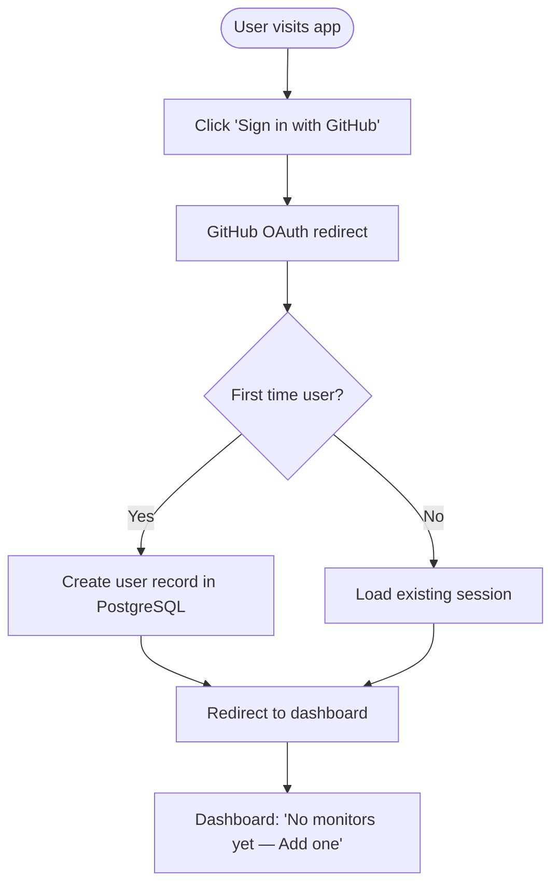

---

### 6.2 Create Monitor Flow

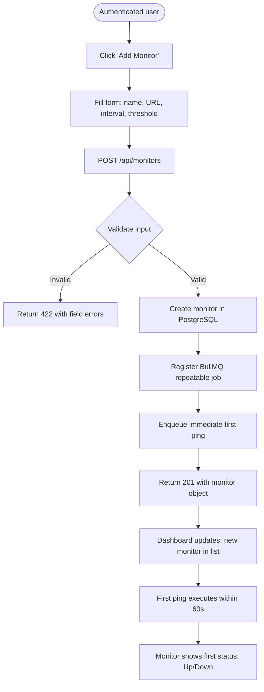

---

### 6.3 Incident Flow — User Perspective

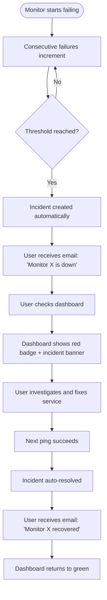

---

### 6.4 Public Status Page Visitor Flow

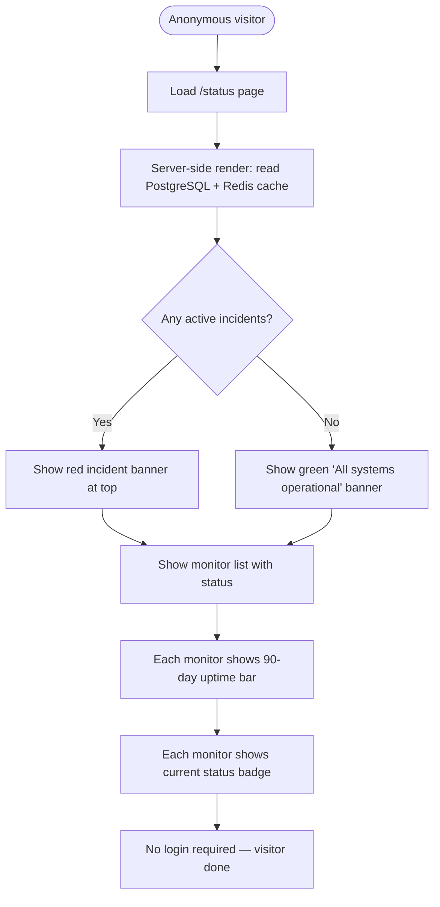

---

### 6.5 Pause / Resume Monitor

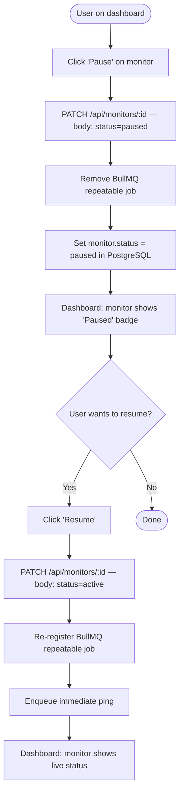

---

## 7. Application Flow

### 7.1 Complete Ping Cycle — Backend Flow

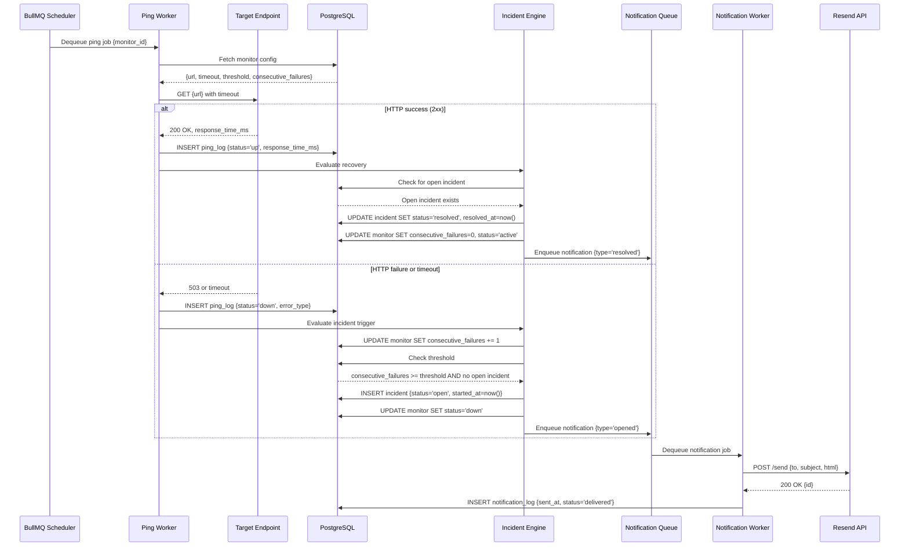

---

### 7.2 Monitor Creation Flow

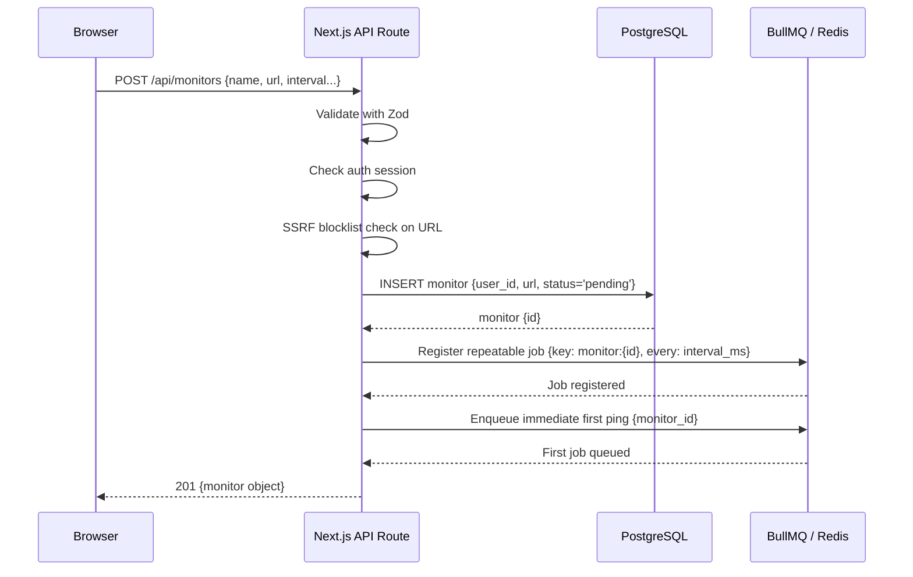

---

### 7.3 Data Retention Flow

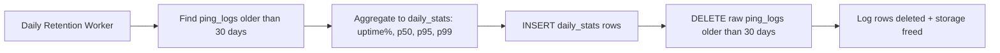

---

## 8. System Architecture

### 8.1 Architecture Overview

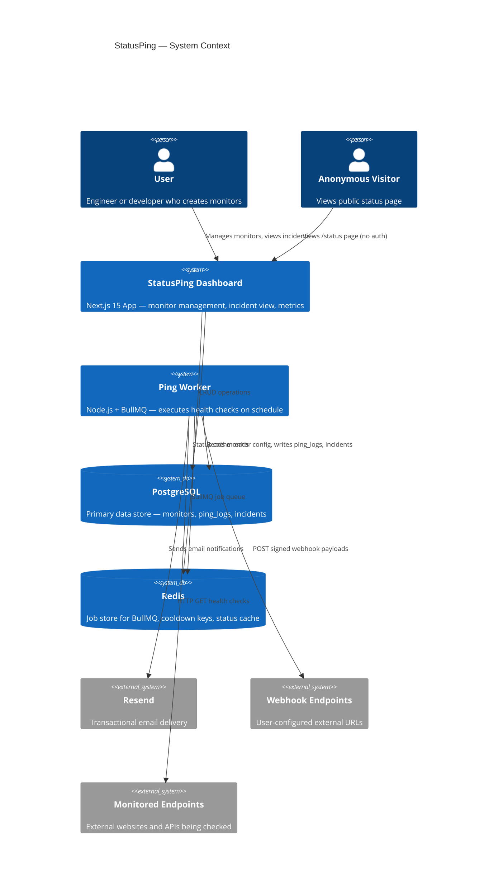

---

### 8.2 Component Responsibilities

#### Dashboard (Railway Service 1)

**Technology:** Next.js 15 App Router, TypeScript, Prisma, Auth.js v5

**Responsibilities:**
- Serve the authenticated dashboard (SSR + client components)
- Handle all REST API routes (`/api/*`)
- Render the public `/status` page (SSR, no auth)
- Read from PostgreSQL via Prisma
- Read status cache from Redis (status page only)

**Explicitly NOT responsible for:**
- Executing ping jobs
- Scheduling health checks
- Processing BullMQ queues

**Why separate from the worker?** Next.js deployed on Railway runs as a web server — it handles HTTP requests from users. If ping execution lived here, a slow batch of HTTP checks would block dashboard API responses. More critically: Vercel (the typical Next.js host) uses serverless functions that time out at 10 seconds and have no persistent process. BullMQ requires a long-running Node.js process.

---

#### Ping Worker (Railway Service 2)

**Technology:** Node.js, TypeScript, BullMQ, Prisma (shared client)

**Responsibilities:**
- On startup: read all active monitors from PostgreSQL; register BullMQ repeatable jobs
- Process ping queue: execute HTTP health checks
- Process incident queue: evaluate failures, create/resolve incidents
- Process notification queue: deliver email and webhook notifications
- Process retention queue: aggregate and delete old ping logs

**Why a separate process?**
1. Long-running process requirement (BullMQ workers cannot run in serverless)
2. Failure isolation: a worker crash does not take down the dashboard
3. Independent scaling: add worker instances without touching the Next.js app
4. Resource isolation: heavy CPU/network work from HTTP pinging doesn't compete with dashboard API latency

---

#### PostgreSQL

**Why PostgreSQL over MongoDB or DynamoDB?**

StatusPing's data has strong relational characteristics:
- Users own monitors (foreign key)
- Monitors have incidents (foreign key, with uniqueness constraint)
- Incidents have notification logs (foreign key)
- Ping logs are time-series but require JOINs to monitors

PostgreSQL's JSONB support handles flexible notification config payloads. Time-series queries (response time percentiles, 90-day uptime bars) are efficient with composite indexes on `(monitor_id, checked_at)`. The unique partial index for open incidents (`WHERE status = 'open'`) is a PostgreSQL-specific feature that prevents duplicate incidents at the database level.

---

#### Redis

Redis serves three distinct purposes in StatusPing:

1. **BullMQ job store** — All queue state (pending, active, completed, failed jobs) lives in Redis. This is BullMQ's mandatory dependency.

2. **Notification cooldown keys** — `cooldown:{monitor_id}:{notification_channel_id}` with TTL = 30 minutes. Prevents duplicate alert storms when a monitor flaps.

3. **Status page cache** — `status:page:data` with TTL = 60 seconds. The status page query joins monitors, incidents, and daily_stats — expensive to run on every visitor request. A 60-second Redis cache reduces database load dramatically.

**Why not use PostgreSQL for all three?** Job queuing in a relational database (polling a `jobs` table) introduces write amplification, lock contention, and polling overhead. Redis's atomic operations (`SETNX`, `EXPIRE`, pub/sub) are purpose-built for this. The cooldown TTL mechanism would require a scheduled cleanup job in PostgreSQL; in Redis it's automatic.

---

#### BullMQ

BullMQ is a production-grade job queue for Node.js backed by Redis. It provides:
- **Repeatable jobs** with cron or fixed-interval scheduling
- **Concurrency control** at the worker level
- **Automatic retry** with configurable backoff strategies
- **Dead letter queues** (failed jobs after max retries)
- **Job prioritization**
- **Rate limiting** per queue

**Why BullMQ over `node-cron`?**

`node-cron` runs in the same Node.js process, doesn't survive restarts (jobs lost on crash), cannot be distributed across multiple workers, and has no retry or dead-letter capabilities. BullMQ's jobs are persisted in Redis — a worker crash does not lose scheduled jobs.

**Why BullMQ over `bull` (v3)?** BullMQ is the actively maintained successor to `bull`. It uses Redis Streams for improved performance and has TypeScript types natively.

---

### 8.3 Service Boundary Diagram

```mermaid
graph TB
    subgraph "Railway Service 1: Dashboard"
        NEXT[Next.js 15 App Router]
        NEXT --> API[API Route Handlers]
        NEXT --> STATUS[/status - SSR]
        NEXT --> AUTH[Auth.js v5]
    end

    subgraph "Railway Service 2: Worker"
        WORKER[Node.js Process]
        WORKER --> PQ[Ping Queue Consumer]
        WORKER --> IQ[Incident Queue Consumer]
        WORKER --> NQ[Notification Queue Consumer]
        WORKER --> RQ[Retention Queue Consumer]
        WORKER --> STARTUP[Startup: Re-register Jobs]
    end

    subgraph "Railway Add-ons"
        PG[(PostgreSQL)]
        REDIS[(Redis)]
    end

    subgraph "External"
        RESEND[Resend API]
        HOOKS[Webhook Endpoints]
        TARGETS[Monitored URLs]
    end

    API <-->|Prisma| PG
    STATUS <-->|Prisma + Cache| PG
    STATUS <-->|60s TTL cache| REDIS
    PQ <-->|BullMQ| REDIS
    PQ <-->|Prisma| PG
    PQ -->|HTTP GET| TARGETS
    NQ -->|SMTP API| RESEND
    NQ -->|HMAC POST| HOOKS
```

---

## 9. Database Design

### 9.1 Schema Design Principles

**Normalization level:** Third Normal Form (3NF) with deliberate denormalization where query performance justifies it. `monitor.consecutive_failures` is a denormalized counter — the ground truth is `ping_logs`, but recomputing it from raw logs on every ping evaluation would be expensive.

**Soft deletes:** All user-owned entities (`monitors`, `incidents`, `notification_configs`) use `deleted_at TIMESTAMP NULL`. Queries always filter `WHERE deleted_at IS NULL`. Hard deletes execute via the retention worker 30 days post-soft-delete.

**Audit fields:** Every table has `created_at` and `updated_at`. Workers set `updated_at` on every write. Prisma middleware auto-populates `updated_at`.

**UTC timestamps:** All timestamps stored as `TIMESTAMP WITH TIME ZONE` in UTC. Never store local time.

---

### 9.2 Table Definitions

#### `users`

```sql
CREATE TABLE users (
    id            TEXT PRIMARY KEY DEFAULT gen_random_uuid()::text,
    email         TEXT NOT NULL UNIQUE,
    name          TEXT,
    github_id     TEXT UNIQUE,
    avatar_url    TEXT,
    created_at    TIMESTAMPTZ NOT NULL DEFAULT NOW(),
    updated_at    TIMESTAMPTZ NOT NULL DEFAULT NOW()
);
```

**Why TEXT for primary key?** Auth.js v5 generates string UUIDs; matching its convention avoids type casting.

---

#### `monitors`

```sql
CREATE TABLE monitors (
    id                       TEXT PRIMARY KEY DEFAULT gen_random_uuid()::text,
    user_id                  TEXT NOT NULL REFERENCES users(id) ON DELETE CASCADE,
    name                     TEXT NOT NULL,
    url                      TEXT NOT NULL,
    check_interval_minutes   INTEGER NOT NULL DEFAULT 5
                               CHECK (check_interval_minutes IN (1, 5, 15, 30, 60)),
    failure_threshold        INTEGER NOT NULL DEFAULT 2
                               CHECK (failure_threshold BETWEEN 1 AND 5),
    timeout_seconds          INTEGER NOT NULL DEFAULT 10
                               CHECK (timeout_seconds BETWEEN 5 AND 30),
    status                   TEXT NOT NULL DEFAULT 'pending'
                               CHECK (status IN ('pending','active','degraded','down','paused')),
    consecutive_failures     INTEGER NOT NULL DEFAULT 0,
    keyword_check            TEXT,
    status_page_visible      BOOLEAN NOT NULL DEFAULT TRUE,
    last_checked_at          TIMESTAMPTZ,
    deleted_at               TIMESTAMPTZ,
    created_at               TIMESTAMPTZ NOT NULL DEFAULT NOW(),
    updated_at               TIMESTAMPTZ NOT NULL DEFAULT NOW()
);

CREATE INDEX idx_monitors_user_id ON monitors(user_id)
    WHERE deleted_at IS NULL;
CREATE INDEX idx_monitors_status ON monitors(status)
    WHERE deleted_at IS NULL AND status IN ('active','degraded','down');
```

**`consecutive_failures`:** Denormalized counter. Faster than COUNT(*) on ping_logs per ping cycle. Reset to 0 on recovery. Updated atomically with the ping_log INSERT in a transaction.

**CHECK constraints on `status`:** Prevents invalid states at the database level — not just application level.

---

#### `ping_logs`

```sql
CREATE TABLE ping_logs (
    id              BIGSERIAL PRIMARY KEY,
    monitor_id      TEXT NOT NULL REFERENCES monitors(id) ON DELETE CASCADE,
    checked_at      TIMESTAMPTZ NOT NULL DEFAULT NOW(),
    is_up           BOOLEAN NOT NULL,
    status_code     INTEGER,
    response_time_ms INTEGER,
    error_type      TEXT CHECK (error_type IN (
                        'TIMEOUT','DNS_FAILURE','CONNECTION_REFUSED',
                        'SSL_ERROR','REDIRECT_LIMIT','HTTP_ERROR',NULL
                    )),
    redirect_count  SMALLINT DEFAULT 0,
    final_url       TEXT
) PARTITION BY RANGE (checked_at);

-- Monthly partitions (create for current + next 2 months at a time)
CREATE TABLE ping_logs_2025_01 PARTITION OF ping_logs
    FOR VALUES FROM ('2025-01-01') TO ('2025-02-01');

CREATE INDEX idx_ping_logs_monitor_checked ON ping_logs(monitor_id, checked_at DESC);
CREATE INDEX idx_ping_logs_is_up ON ping_logs(monitor_id, is_up, checked_at DESC)
    WHERE is_up = FALSE;
```

**Why `BIGSERIAL` not UUID?** Ping logs are insert-heavy time-series data. Sequential integer IDs are more efficient for B-tree indexes than UUIDs (which fragment the index due to randomness). Ping logs are never referenced by ID externally — only queried by `monitor_id` + time range.

**Partitioning by month:** With 100 monitors at 1 ping/min, a single partition holds ~4.3M rows/month. Partition pruning makes time-bounded queries (last 30 days) dramatically faster — PostgreSQL only scans the relevant partition(s). Old partitions are dropped wholesale by the retention worker — infinitely faster than DELETE.

**The `final_url` column:** Captures redirect destination. If a monitor's URL starts redirecting to an unexpected domain (e.g., a domain expiry hijack), this appears in the log.

---

#### `daily_stats`

```sql
CREATE TABLE daily_stats (
    id              BIGSERIAL PRIMARY KEY,
    monitor_id      TEXT NOT NULL REFERENCES monitors(id) ON DELETE CASCADE,
    stat_date       DATE NOT NULL,
    total_checks    INTEGER NOT NULL DEFAULT 0,
    successful_checks INTEGER NOT NULL DEFAULT 0,
    uptime_percent  NUMERIC(5,2),
    p50_ms          INTEGER,
    p95_ms          INTEGER,
    p99_ms          INTEGER,
    created_at      TIMESTAMPTZ NOT NULL DEFAULT NOW()
);

CREATE UNIQUE INDEX idx_daily_stats_monitor_date
    ON daily_stats(monitor_id, stat_date);
```

**Why separate from `ping_logs`?** After 30 days, raw ping logs are too expensive to scan for the status page's 90-day uptime bars. `daily_stats` stores pre-aggregated summaries. The status page reads from this table — a fast index scan on `(monitor_id, stat_date)` over a 90-row result.

---

#### `incidents`

```sql
CREATE TABLE incidents (
    id               TEXT PRIMARY KEY DEFAULT gen_random_uuid()::text,
    monitor_id       TEXT NOT NULL REFERENCES monitors(id) ON DELETE CASCADE,
    status           TEXT NOT NULL DEFAULT 'open'
                       CHECK (status IN ('open','resolved')),
    started_at       TIMESTAMPTZ NOT NULL DEFAULT NOW(),
    resolved_at      TIMESTAMPTZ,
    duration_seconds INTEGER GENERATED ALWAYS AS (
                         EXTRACT(EPOCH FROM (resolved_at - started_at))::INTEGER
                     ) STORED,
    root_cause       TEXT,
    error_type       TEXT,
    deleted_at       TIMESTAMPTZ,
    created_at       TIMESTAMPTZ NOT NULL DEFAULT NOW(),
    updated_at       TIMESTAMPTZ NOT NULL DEFAULT NOW()
);

-- THE critical constraint: at most one open incident per monitor
CREATE UNIQUE INDEX idx_incidents_monitor_open
    ON incidents(monitor_id)
    WHERE status = 'open' AND deleted_at IS NULL;

CREATE INDEX idx_incidents_monitor_id ON incidents(monitor_id, started_at DESC)
    WHERE deleted_at IS NULL;
```

**Partial unique index:** `WHERE status = 'open'` — PostgreSQL only enforces uniqueness for rows matching this predicate. Resolved incidents are not affected. This is a database-level race condition guard: two concurrent workers attempting to create an incident for the same monitor will produce a unique constraint violation; one will succeed, one will be rolled back cleanly.

**`duration_seconds` as generated column:** Computed automatically on insert/update; no application logic required. Available for SLA report queries directly.

---

#### `notification_configs`

```sql
CREATE TABLE notification_configs (
    id          TEXT PRIMARY KEY DEFAULT gen_random_uuid()::text,
    monitor_id  TEXT NOT NULL REFERENCES monitors(id) ON DELETE CASCADE,
    user_id     TEXT NOT NULL REFERENCES users(id) ON DELETE CASCADE,
    type        TEXT NOT NULL CHECK (type IN ('email','webhook')),
    -- Email specific
    email       TEXT,
    -- Webhook specific
    url         TEXT,
    secret_hash TEXT,  -- SHA-256 of HMAC secret (never store plaintext)
    -- Common
    on_incident_open    BOOLEAN NOT NULL DEFAULT TRUE,
    on_incident_resolve BOOLEAN NOT NULL DEFAULT TRUE,
    deleted_at  TIMESTAMPTZ,
    created_at  TIMESTAMPTZ NOT NULL DEFAULT NOW(),
    updated_at  TIMESTAMPTZ NOT NULL DEFAULT NOW()
);

CREATE INDEX idx_notification_configs_monitor
    ON notification_configs(monitor_id)
    WHERE deleted_at IS NULL;
```

---

#### `notification_logs`

```sql
CREATE TABLE notification_logs (
    id                      BIGSERIAL PRIMARY KEY,
    notification_config_id  TEXT NOT NULL REFERENCES notification_configs(id),
    incident_id             TEXT NOT NULL REFERENCES incidents(id),
    event_type              TEXT NOT NULL CHECK (event_type IN ('opened','resolved')),
    status                  TEXT NOT NULL CHECK (status IN ('pending','delivered','failed','suppressed')),
    attempts                SMALLINT NOT NULL DEFAULT 0,
    last_attempt_at         TIMESTAMPTZ,
    delivered_at            TIMESTAMPTZ,
    error_message           TEXT,
    created_at              TIMESTAMPTZ NOT NULL DEFAULT NOW()
);

CREATE INDEX idx_notification_logs_incident
    ON notification_logs(incident_id);
```

---

#### `ssl_checks`

```sql
CREATE TABLE ssl_checks (
    id              BIGSERIAL PRIMARY KEY,
    monitor_id      TEXT NOT NULL REFERENCES monitors(id) ON DELETE CASCADE,
    checked_at      TIMESTAMPTZ NOT NULL DEFAULT NOW(),
    expires_at      TIMESTAMPTZ,
    days_remaining  INTEGER,
    issuer          TEXT,
    is_valid        BOOLEAN NOT NULL,
    error_message   TEXT
);

CREATE INDEX idx_ssl_checks_monitor ON ssl_checks(monitor_id, checked_at DESC);
```

---

#### `dead_letter_jobs`

```sql
CREATE TABLE dead_letter_jobs (
    id              BIGSERIAL PRIMARY KEY,
    queue_name      TEXT NOT NULL,
    job_id          TEXT,
    job_data        JSONB NOT NULL,
    error_message   TEXT,
    attempts        SMALLINT NOT NULL,
    failed_at       TIMESTAMPTZ NOT NULL DEFAULT NOW(),
    replayed_at     TIMESTAMPTZ
);
```

Dead-lettered jobs are inspectable via an admin API endpoint. The `replayed_at` column tracks whether an operator manually re-queued the job.

---

### 9.3 Entity Relationship Diagram

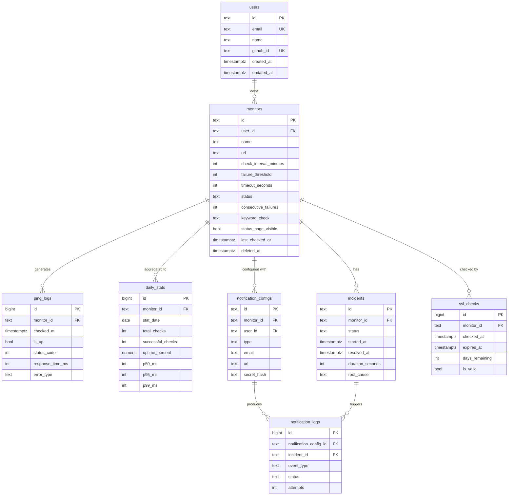

---

### 9.4 Indexing Strategy

**Core principle:** Index for read patterns, not write patterns. Writes in StatusPing are append-only (ping_logs, notification_logs) or point updates (monitor status). Reads are the bottleneck for dashboard and status page queries.

| Query Pattern | Index |
|---|---|
| Dashboard: all monitors for user | `(user_id) WHERE deleted_at IS NULL` |
| Ping worker: fetch active monitors | `(status) WHERE deleted_at IS NULL AND status IN (...)` |
| Response time chart: last N logs for monitor | `(monitor_id, checked_at DESC)` on ping_logs |
| Status page: 90-day uptime per monitor | `(monitor_id, stat_date)` on daily_stats (unique) |
| Incident list for monitor | `(monitor_id, started_at DESC) WHERE deleted_at IS NULL` |
| Open incident check | `(monitor_id) WHERE status='open'` on incidents (partial unique) |

---

### 9.5 Data Retention Strategy

```mermaid
gantt
    title Data Lifecycle
    dateFormat  X
    axisFormat Day %d

    section ping_logs (raw)
    Retained raw           :0, 30
    Aggregated + deleted   :30, 31

    section daily_stats
    Retained indefinitely  :0, 90

    section incidents
    Soft deleted           :0, 30
    Hard deleted           :30, 31

    section notification_logs
    Retained indefinitely  :0, 90
```

The retention worker runs once daily (BullMQ cron job: `0 2 * * *` — 2am UTC to avoid peak hours):
1. Aggregate `ping_logs` older than 30 days into `daily_stats` (if not already aggregated)
2. `DROP` old ping_logs partitions (monthly partition dropping is O(1))
3. Hard-delete soft-deleted monitors/incidents older than 30 days

---

## 10. Business Rules

### BR-001 — Monitor Ownership Enforcement

| Field | Value |
|---|---|
| **ID** | BR-001 |
| **Rule** | Every API operation on a monitor must verify `monitor.user_id === authenticated_user.id` |
| **Reason** | Prevents horizontal privilege escalation — User A reading/modifying User B's monitors |
| **Implementation** | All Prisma queries include `WHERE user_id = session.user.id` — never fetch by `id` alone |
| **Edge Cases** | Admin tooling (future) bypasses this rule. Worker process bypasses this rule (runs as system, not user). |

---

### BR-002 — Consecutive Failure Threshold

| Field | Value |
|---|---|
| **ID** | BR-002 |
| **Rule** | An incident is created only after `consecutive_failures >= failure_threshold` |
| **Reason** | Eliminates false positives from transient network blips. A single timeout should not page an engineer at 3am. |
| **Implementation** | Worker increments `monitor.consecutive_failures` atomically. Check threshold after increment. |
| **Edge Cases** | If 1 failure occurs then 1 success then 1 failure: `consecutive_failures` resets to 0 on success, then increments to 1 on next failure. No incident created. |

---

### BR-003 — Single Open Incident Per Monitor

| Field | Value |
|---|---|
| **ID** | BR-003 |
| **Rule** | At most one incident with `status = 'open'` may exist per monitor at any time |
| **Reason** | Prevents duplicate alerts and notification storms during extended outages |
| **Implementation** | PostgreSQL partial unique index on `(monitor_id) WHERE status = 'open'`. Concurrent workers attempting duplicate inserts receive a unique constraint violation; the incident engine catches this and treats it as "incident already exists — skip." |
| **Edge Cases** | Worker A and Worker B both detect failure simultaneously. Both attempt INSERT. One succeeds; one receives `23505` PostgreSQL error code. Worker B logs "incident already open" and continues. |

---

### BR-004 — Notification Cooldown

| Field | Value |
|---|---|
| **ID** | BR-004 |
| **Rule** | After an incident-open notification is sent, no further incident-open notifications are sent for the same monitor within the cooldown window (30 minutes default) |
| **Reason** | Prevents alert fatigue during extended outages where each ping failure would otherwise trigger a new email |
| **Implementation** | Redis key `cooldown:{monitor_id}:{notification_config_id}` set on first notification send, with TTL = 1800 seconds. Notification worker checks for key existence before sending. |
| **Edge Cases** | Resolution notifications (`event_type = 'resolved'`) always send regardless of cooldown — an operator must know when a service recovers. Cooldown key deleted on resolution. |

---

### BR-005 — SSRF Prevention

| Field | Value |
|---|---|
| **ID** | BR-005 |
| **Rule** | Monitor URLs must not target internal/private network addresses |
| **Reason** | A malicious user could create a monitor targeting `http://169.254.169.254/latest/meta-data/` (AWS metadata service) or internal Railway services, allowing data exfiltration via ping response times or content |
| **Implementation** | On monitor creation: resolve the URL's hostname to an IP address. Reject if the IP falls within: `127.0.0.0/8`, `10.0.0.0/8`, `172.16.0.0/12`, `192.168.0.0/16`, `169.254.0.0/16`, `::1/128`, `fc00::/7` |
| **Edge Cases** | DNS rebinding attack: the hostname resolves to a public IP at creation time, but DNS is changed to a private IP later. Mitigation: re-validate the resolved IP at ping execution time in the worker, not just at monitor creation. |

---

### BR-006 — Data Retention Schedule

| Field | Value |
|---|---|
| **ID** | BR-006 |
| **Rule** | Raw `ping_logs` older than 30 days must be aggregated into `daily_stats` and then deleted |
| **Reason** | Unbounded ping log growth causes PostgreSQL performance degradation. At 100 monitors × 1 ping/min, raw logs grow by ~52M rows/year. |
| **Implementation** | Retention worker runs at 2am UTC daily. Uses PostgreSQL partition dropping for bulk deletion (O(1) vs O(N) DELETE). |
| **Edge Cases** | If the retention worker fails, logs accumulate. The worker must be idempotent: aggregating and deleting logs for a day that was already processed should be a no-op (UPSERT on `daily_stats` with `ON CONFLICT DO NOTHING`). |

---

### BR-007 — Monitor Deletion Safeguard

| Field | Value |
|---|---|
| **ID** | BR-007 |
| **Rule** | Deleting a monitor with an open incident requires explicit `?force=true` confirmation |
| **Reason** | Prevents accidental data loss during active incidents. An engineer pausing an investigation might accidentally delete evidence. |
| **Implementation** | Soft delete sets `deleted_at`. BullMQ worker checks `deleted_at` before writing ping results; discards job silently if set. Hard delete after 30 days. |
| **Edge Cases** | In-flight BullMQ job when monitor is deleted: job dequeued after deletion. Worker checks `deleted_at` on monitor fetch. If set, logs "monitor deleted — discarding result" and returns without writing. |

---

### BR-008 — SSL Expiry Alert Threshold

| Field | Value |
|---|---|
| **ID** | BR-008 |
| **Rule** | An SSL certificate with ≤ 30 days until expiry triggers a notification |
| **Reason** | SSL certificate expiry is a common, preventable outage cause. 30 days provides sufficient lead time for renewal. |
| **Implementation** | SSL check runs alongside each ping (for HTTPS monitors). `days_remaining` computed and stored in `ssl_checks`. If `days_remaining <= 30` and no SSL alert sent in the last 7 days: enqueue notification. |
| **Edge Cases** | Certificate renewed mid-period: `days_remaining` increases; alert suppressed automatically. |

---

### BR-009 — Redirect Handling

| Field | Value |
|---|---|
| **ID** | BR-009 |
| **Rule** | HTTP redirects are followed up to 3 hops. Monitor is marked `degraded` if the final URL differs from the configured URL. |
| **Reason** | Redirects are often intentional (HTTP→HTTPS). But unexpected redirects (domain hijack, CDN misconfiguration) should be surfaced, not silently followed. |
| **Implementation** | Worker uses `fetch` with `redirect: 'follow'` and manually counts hops via a custom redirect handler. Final URL stored in `ping_log.final_url`. |
| **Edge Cases** | Infinite redirect loop: the 3-hop limit causes the check to fail with `error_type = 'REDIRECT_LIMIT'`. |

---

### BR-010 — Idempotent Job Execution

| Field | Value |
|---|---|
| **ID** | BR-010 |
| **Rule** | A BullMQ job that executes twice (due to worker crash mid-execution) must not produce duplicate incidents |
| **Reason** | BullMQ provides at-least-once delivery. A job may run twice in edge cases. |
| **Implementation** | Duplicate `ping_log` rows are acceptable (they are append-only records). Incident deduplication is handled by the partial unique index (BR-003). Notification deduplication is handled by the cooldown TTL (BR-004). |
| **Edge Cases** | Two identical `ping_log` rows for the same `monitor_id` and `checked_at` (within milliseconds) — acceptable. The incident engine reads `consecutive_failures` from the monitor record (updated atomically), not from raw ping log count. |

---
